# Build-A-Monster

## The Ultimate Monster Building Experience

#### Current Status: Minimum Viable Product (MVP) Complete

#### MVP Dashboard: https://thecarpedm.github.io/DND/ 

#### Presentation for MVP: https://docs.google.com/presentation/d/1p2H1VOYV1S2l-KxgNv2MTVLyTSLPGuzVoiJnb_SPr14/edit?usp=sharing

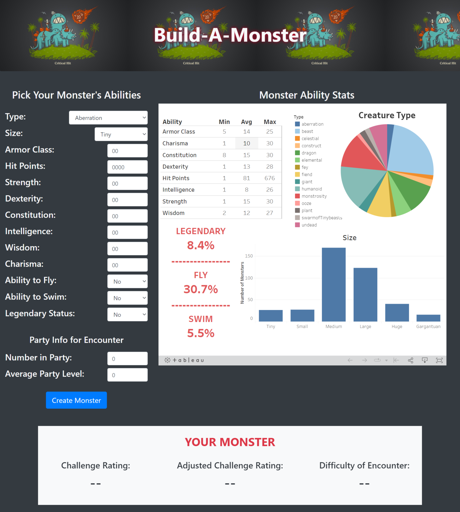

## Overview
The task was to create a dashboard where a user could input characteristic and ability ratings for a monster and the dashboard will automatically return the predicted challenge rating for the newly created monster. Additional features to this dashboard will be having the monster database pull statistical and categorical summaries to the webpage dashboard through a Tableau dashboard as well as additional values for adjusted challenge rating and encounter difficulty when given party level and size.

The reason for this project was to give anyone that plays the game more insight into what influences the challenge rating of a monster as well as allow players to spice up their game with a custom made monster.

This analysis is looking to answer 3 large questions in order to properly build this dashboard:
1. Can a monster’s challenge rating be predicted with given characteristics?
2. Can we adjust the monster’s challenge rating change for party size?
3. Can we predict the difficulty of an encounter with this monster for a specific party?

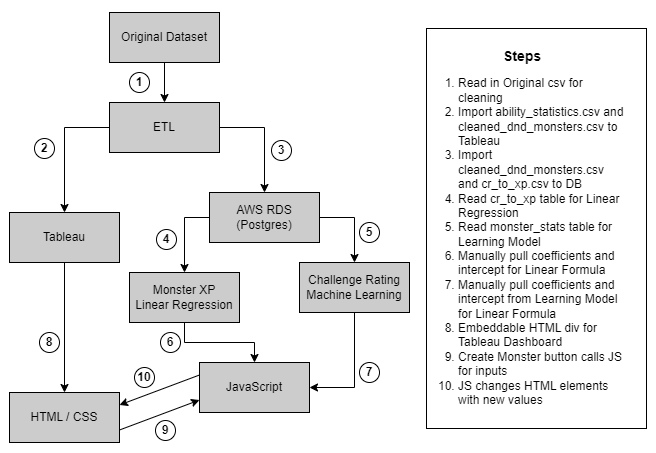

## Process and Analysis
### Technology Used
- Python (Jupyter Notebook)
    - pandas
    - regular expression
    - scikit-learn
    - psycopg2
    - getpass
    - sqlalchemy
    - Matplotlib
- AWS
    - RDS (Postgres)
    - S3
- PostgreSQL (pgAdmin4)
- Tableau
- HTML
- CSS (Bootstrap)
- JavaScript

### Steps
#### Dataset
**Main Data Used: [DnD 5e Monsters | Kaggle](https://www.kaggle.com/datasets/mrpantherson/dnd-5e-monsters)**

This data gave us many monsters and their features to use for our regression.
- name - the name of the creature
- url - url to a detailed page of the creature’s information
- cr (challenge rating) - how difficult the creature is to defeat
- type - the type of creature
- size - size of the creature
- ac (armor class) - how difficult the creature is to hit 
- hp (hit points) - how much damage a creature can take before being defeated
- str (strength) - how easily a creature can smash a tomato
- dex (dexterity) - how well could a creature avoid getting hit with a tomato
- con (constitution) - could the creature eat a moldy tomato and not get sick
- int (intelligence) - does the creature know if a tomato is a vegetable or a fruit 
- wis (wisdom) - does the creature know what to pair with a tomato
- cha (charisma) - could the creature sell you a tomato 
- fly - creature has ability to fly or not
- swim - creature has the ability to swim or not
- legendary - creature is legendary or not

**Additional Data Used**
- Fixed Character value thresholds [Building-combat-encounters](https://www.dndbeyond.com/sources/basic-rules/building-combat-encounters)
    - This was used in the JavaScript to compare the threshold values with Monster XP
- Monster XP to CR  data [Monsters by Challenge Rating - Monster Manual](https://media.wizards.com/2014/downloads/dnd/MM_MonstersCR.pdf)
    - This data was used in the Monster XP Regression to predict the XP given a CR

**Cleaning Data**

Most of the data cleaning was relatively standard but there were a few challenges that our team ran into as we moved through the ETL process. 

- 1st hurdle: Panda reads fractions as objects and the column needed to be floats to run future code.
    - Needed to look up formulas to convert those fractions (see image).
    
    
    
- 2nd hurdle: The 'speed' column was split into two columns: fly & swim. We then needed to fill the empty data with filler for another conversion formula (see image).
    - Then those two columns and the legendary columns were changed to be a simple yes/no.
    
    
    
- 3rd hurdle: There were too many types (71) and it was bogging down the machine learning process.
    - There were 15 basic types, with the rest being sub-types. We eliminated the sub-types through a regular expression formula to delete the parenthesis and anything       between them (see image)
    
    

**Creating tables**

After cleaning the data we created the 3 tables we would use for this MVP using the columns from our original data sources. Tables 1 and 2 were then imported in the AWS RDS and Table 1 and 3 were then uploaded to Tableau. 
1. cleaned_monster.csv - fed the majority of the Tableau Dashboard, Challenge Rating Linear Regression, and is table 2 in the database
2. cr_to_xp.csv - fed the results of Monster XP Linear Regression, and is table 1 in the database
3. ability_statistics.csv - fed the Ability Summary description table in Tableau Dashboard

#### Database
**ERD**

Table 1: "cr_to_xp" from cr_to_xp.csv
- This will be used for Monster XP Linear Regression in order to predict XP with CR's we don't have a data point on.
- Primary Key: cr (challenge rating)

Table 2: "monster_stats" from cleaned_monster_stats.csv
- Primary Key: name (monster name)
- Foreign Key: cr (challenge) = cr.cr_to_xp
    - many to one relationship

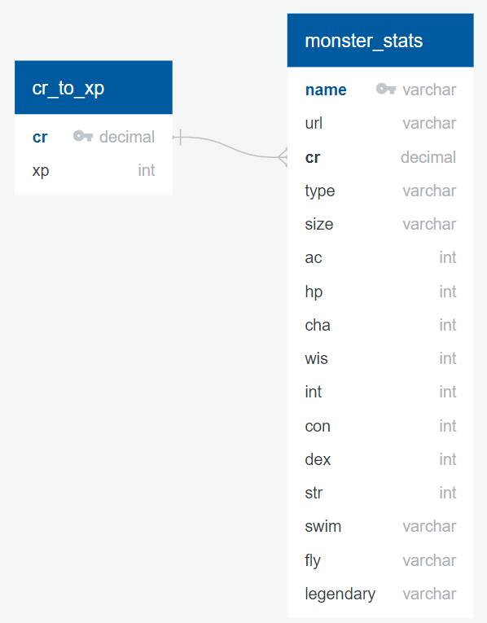

AWS RDS (Postgres)
This was pretty simple because you're just connecting the AWS RDS(POstgres) to a local pgAdmin4 database to create intial tables and structure from ERD. Deciding to import cr_to_xp allowed us to run the alter table for the foreign key connection after uploading the monster_stats table.

#### Machine Learning
**Challenge Rating Linear Regression**

Based on our dataset, we used multiple linear regression to evaluate the relationship between different monster characteristics (size, ac, hp, legendary, str, dex, con, int, wis, cha, fly, swim, and type) to determine the monster's challenge rating (cr). The majority of our dataset was numeric where a higher number normally higher ability which would lead to a higher challenge. We one hot encoded the categorical values and then created our target (cr) and features (all monster abilities). We then used scikit learn to split our data into training and testing groups, created the LinearRegression() model, fit the data and predicted the new values. After running the model scores the **Training Score** came back at **94%** accuracy and the **Test Score** came back at **88%** accuracy. We were then able to pull our coefficents and intercept to implement the Linear Regression formula into the JavaScript. Some of the majority findings from the model are that a monster’s challenge rating can be predicted rather accurately and that the variables with the largest coefficients were a monster’s type which means the type factors in quite a bit. We will likely in future want to look at removing certain variables and test if that changes our accuracy.

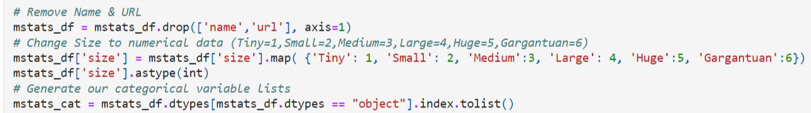
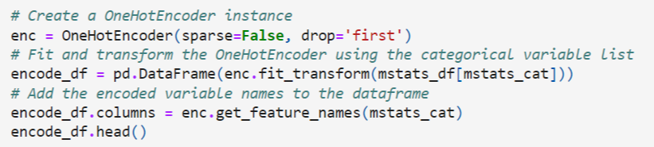
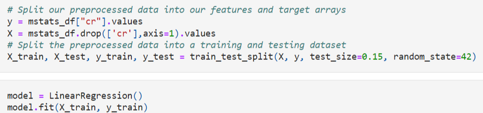

**Coefficient Values:**

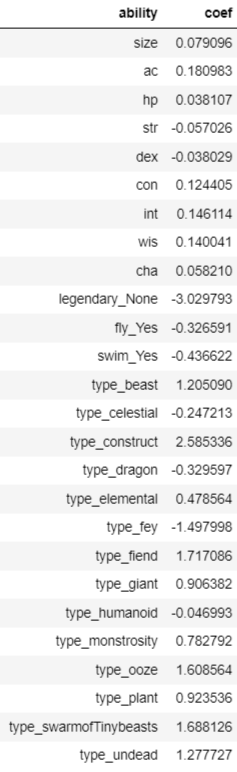

**Monster XP Regression**
This was a simple linear regression with one independent variable with one dependent variable. Taking the values of the feature (CR) and running t fit on the target (XP). This provided a **94%** accuracy rating which was somewhat expected. There's likely a better fit for this because the formula is more exponential than linear because as the cr goes up the xp goea up at higher rate. If there was more time we would want to look into this as well, but doesn't seem like a large factor in the total accuracy of the dashboard.

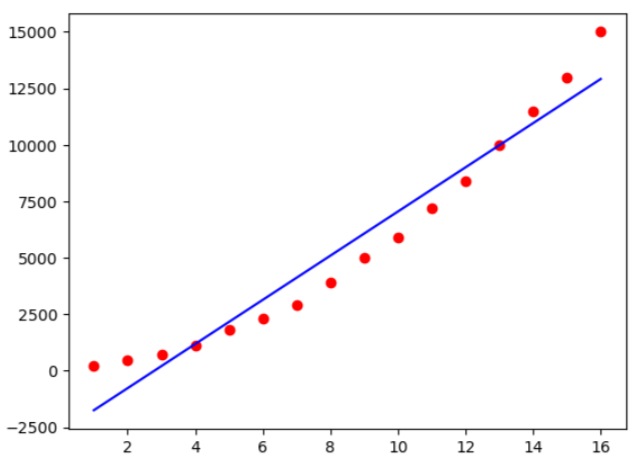

#### Dashboard
The end product the user will see and use where the Tableau Dashboard can be analyzed, values can be input into the HTML form, JavaScript is ran when the "create monster" button is clicked, and then the JavaScript will return the new predicted values to the HTML.

**Tableau**

Created 4 interactive diagrams for the user to look through. This was designed to help users understand what the landscape across all mosnter options there are. There were plenty of learning here about the general sample population of monsters. Over half of the monsters belong to humanoid, beast, or monstrosity of the 15 types. We can also see hit points has a lot higher average and max but not minimum. There's a pretty normal distribution in size as well where the strong majoity are medium and then large with the lowest being garantuan or tiny. And then lastly the distribution of special abilities was a little eye opening for swim, where only 5 percent of the monsters can actually swim. This section of the dashobard is highly underrated because it can provide the key tools to make the right monster ability section as long as the tableau dashboard has that data.
- Size Histogram: shows size distribution of monsters
- Summary Table: highlight summary statistics to numerical features
- Type Pie Chart: shows percent each type of monster
- Percent of Total: percent of monsters that have Legendary,  Fly or  Swim as a feature

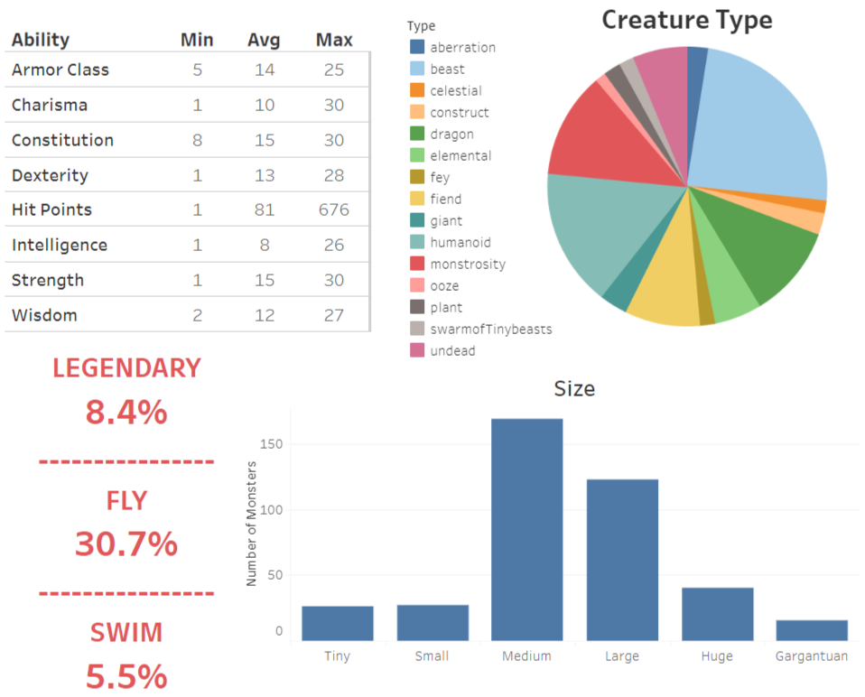

**JavaScript**

In its simplest form its a script that is made up of 3 functions. The first being the triggered function from clicking the create monster button, this is the getInputValues function. This function grabs all inputed fields on the dashboard matching the variables specified "id" in the HTML. This function also mimics the one hot coding from the CR Linear Regression in order to run the formula on the inputed values. The last part of the getInputValues function is to call the formulas function and pass the formula formatted values. Most of the encoding was var setting through nested if statements

The formulas function uses the intercept and coeffiencts from the CR Linear Regression as a equation that will run using the values provided from the getINputValues function. This provided our first value, Challenge Rating. Then the formulas function adjusts the challenge rating to be stronger if 2 or less are playing OR weaker for 6 or more players. This provided the second value, Adjusted Challenge Rating. The adjsted challenge rating is ran through the Monster XP Regression formula using the coefficient and intercept from that regression. This converts the monster adjusted challenge rating into a Monster XP rating. The Monster XP rating gets used as a comparison for the party's XP value based on the threshold dataset and provides an encounter difficulty which is the last value we'll provide the user. To accomplish this we created a large nested if statement find the right average level and then creating a comparsion across all thresholds. This function then calls the addtoHTML function with the CR, adjusted CR, and difficulty values.

The addtoHTML is relatively simple. It runs the difficulty through an if statement to assign the right message for the encounter difficulty, otherwise it's just using inner.HTML and matching it the HTML "id" that the value will update the content inside of.

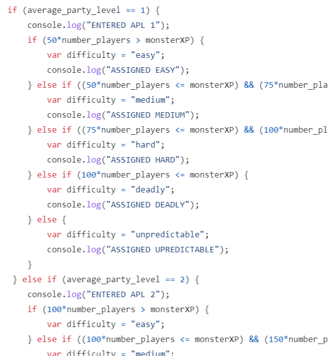

**HTML/CSS**

The HTML and CSS were kept simple using Bootstrap. The largest effort was getting all the drop downs foramtted correctly. Most of the time the JS would have an event listeners but with the simplest version of our MVP we were able to triggered the function by adding onclick="getInputValues()" inside the div of the button. The display for the Your Monster section will be overwritten everytime the create monster button is clicked.

Before:

After:
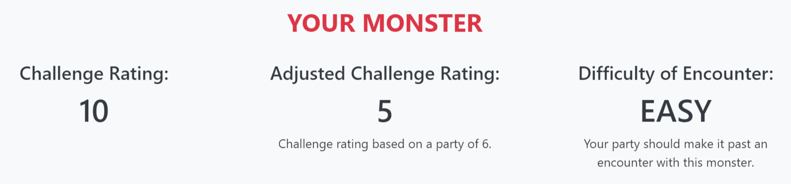

## Future Considerations
There are many directions to go with future iterations of this dashboard. The large iteration would be setting up a **Python Flask API**. This would allow the JavaScript to call this API and run the imputed values against a running learning model with an active database. This also relieves the need to manually update the formulas in the JavaScript. This was a little out of scope for the MVP but would definitely make further development easier as well as allow for easier inclusion of more data when available. With more time this could definitely be done.

**Additional upgrades with more time could be:**
- Strengthen the CR Linear Model: could aim for more than 88% accuracy
    - test less features in regression
    - look for additional data samples or features
    - possibly explore other learning models
- Integrate the Tableau interactivity
- Connect to database
- Tableau DB filtered by CR for improved UX
- Improve HTML/CSS to be more responsive and engaging
- Add more features like multiple monsters or a monster comparison
